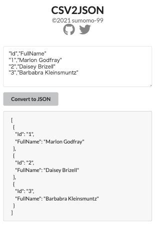

# CSV2JSON
CSV形式のデータをJSONに変換します。


## デモURL
[https://csv2json-sumomo-99.vercel.app/](https://csv2json-sumomo-99.vercel.app/)

## 開発サーバの起動
```bash
npm install
npm run dev
```
ブラウザで[http://localhost:3000](http://localhost:3000)にアクセスします。

## ビルド
```bash
npm run build
```